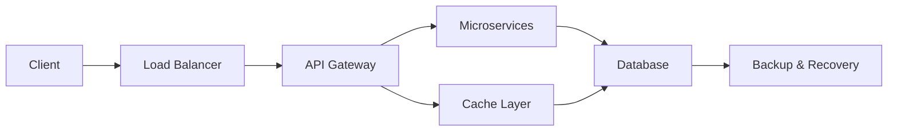

<!-- GitHub Profile README Header -->
<h1 align="center">
  
</h1>

<!-- Matrix-Style Banner -->
<p align="center">
  
</p>

<!-- Introduction with Terminal Style -->
<div align="center">
  
  ```bash
  ┌──[root@sam]─[~/terminal]
  └──╼ $ cat introduction.txt
  
  FullStack Developer & DevOps Expert
  Crafting digital solutions through clean code
  Optimizing systems for maximum performance
  ```
</div>

<!-- Tech Stack -->
<h2 align="center">⚡ Tech Arsenal ⚡</h2>

<table align="center">
  <tr>
    <td align="center" width="96">
      <a href="#javascript">
        
      </a>
      <br>JavaScript
    </td>
    <td align="center" width="96">
      <a href="#nodejs">
        
      </a>
      <br>Node.js
    </td>
    <td align="center" width="96">
      <a href="#express">
        
      </a>
      <br>Express.js
    </td>
    <td align="center" width="96">
      <a href="#react">
        
      </a>
      <br>React.js
    </td>
    <td align="center" width="96">
      <a href="#nextjs">
        
      </a>
      <br>Next.js
    </td>
    <td align="center" width="96">
      <a href="#mysql">
        
      </a>
      <br>MySQL
    </td>
  </tr>
  <tr>
    <td align="center" width="96">
      <a href="#html">
        
      </a>
      <br>HTML5
    </td>
    <td align="center" width="96">
      <a href="#css">
        
      </a>
      <br>CSS3
    </td>
    <td align="center" width="96">
      <a href="#tailwind">
        
      </a>
      <br>Tailwind
    </td>
    <td align="center" width="96">
      <a href="#bootstrap">
        
      </a>
      <br>Bootstrap
    </td>
    <td align="center" width="96">
      <a href="#graphql">
        
      </a>
      <br>GraphQL
    </td>
    <td align="center" width="96">
      <a href="#restapi">
        
      </a>
      <br>REST API
    </td>
  </tr>
</table>

<!-- DevOps Tools -->
<h2 align="center">🛠️ DevOps Arsenal 🛠️</h2>

<table align="center">
  <tr>
    <td align="center" width="96">
      <a href="#linux">
        
      </a>
      <br>Linux
    </td>
    <td align="center" width="96">
      <a href="#git">
        
      </a>
      <br>Git
    </td>
    <td align="center" width="96">
      <a href="#github">
        
      </a>
      <br>GitHub
    </td>
    <td align="center" width="96">
      <a href="#bash">
        
      </a>
      <br>Bash
    </td>
    <td align="center" width="96">
      <a href="#docker">
        
      </a>
      <br>Docker
    </td>
    <td align="center" width="96">
      <a href="#kubernetes">
        
      </a>
      <br>Kubernetes
    </td>
  </tr>
</table>

<!-- System Architecture Section -->
<h2 align="center">🏗️ System Architecture 🏗️</h2>

<div align="center">
  

</div>

<!-- Project Highlights -->
<h2 align="center">🚀 Project Highlights 🚀</h2>

<div align="center">
  <table>
    <tr>
      <td>
        <h3>🍽️ Digital Menu Platform</h3>
        <p>Multi-template restaurant menu system with Next.js</p>
        <ul>
          <li>Dynamic theming & customization</li>
          <li>Multi-language support</li>
          <li>Mobile-optimized interface</li>
        </ul>
      </td>
      <td>
        <h3>🤖 AI-Integrated Web Apps</h3>
        <p>Applications with OpenAI integration</p>
        <ul>
          <li>Natural language processing</li>
          <li>Automated content generation</li>
          <li>Intelligent data analysis</li>
        </ul>
      </td>
    </tr>
    <tr>
      <td>
        <h3>🏢 Enterprise Systems</h3>
        <p>Large-scale business solutions</p>
        <ul>
          <li>POS, CRM, CMS implementations</li>
          <li>Secure payment processing</li>
          <li>Scalable architecture</li>
        </ul>
      </td>
      <td>
        <h3>⚙️ DevOps Infrastructure</h3>
        <p>Optimized deployment pipelines</p>
        <ul>
          <li>70% faster deployment</li>
          <li>99.99% uptime achievement</li>
          <li>15-minute disaster recovery</li>
        </ul>
      </td>
    </tr>
  </table>
</div>

<!-- GitHub Statistics -->
<h2 align="center">📊 GitHub Stats 📊</h2>

<div align="center">
  <a href="https://github.com/uidsam?tab=repositories">
    
  </a>
</div>

<div align="center">
  <a href="https://github.com/uidsam?tab=repositories">
    
  </a>
</div>

<div align="center">
  <a href="https://github.com/uidsam?tab=repositories">
    
  </a>
</div>

<!-- Terminal Section -->
<h2 align="center">🔐 Security & Optimization 🔐</h2>

<div align="center">
  
```bash
┌──[root@secure-server]─[~/security]
└──╼ $ ./display_security_measures.sh
  
[+] Multi-factor authentication implementation
[+] Database sharding for high-volume transactions
[+] Real-time server monitoring with instant alerts
[+] Automated backup with 15-minute recovery time
[+] Advanced caching & load balancing (300% throughput)
```
</div>

<!-- Footer with ASCII Art -->
<div align="center">

```
 ██████╗ ██████╗ ██████╗ ███████╗    ██╗███████╗    ██╗     ██╗███████╗███████╗
██╔════╝██╔═══██╗██╔══██╗██╔════╝    ██║██╔════╝    ██║     ██║██╔════╝██╔════╝
██║     ██║   ██║██║  ██║█████╗      ██║███████╗    ██║     ██║█████╗  █████╗  
██║     ██║   ██║██║  ██║██╔══╝      ██║╚════██║    ██║     ██║██╔══╝  ██╔══╝  
╚██████╗╚██████╔╝██████╔╝███████╗    ██║███████║    ███████╗██║██║     ███████╗
 ╚═════╝ ╚═════╝ ╚═════╝ ╚══════╝    ╚═╝╚══════╝    ╚══════╝╚═╝╚═╝     ╚══════╝
```


</div>

<!-- Hidden Matrix Text -->
<details>
<summary>Matrix Access Granted</summary>
<br>
<pre>
01010100 01101000 01100101 00100000 01001101 01100001 01110100 01110010 01101001 01111000 00100000 
01101000 01100001 01110011 00100000 01111001 01101111 01110101 00101110 00100000 01000110 01101111 
01101100 01101100 01101111 01110111 00100000 01110100 01101000 01100101 00100000 01110111 01101000 
01101001 01110100 01100101 00100000 01110010 01100001 01100010 01100010 01101001 01110100 00101110
</pre>
</details>
